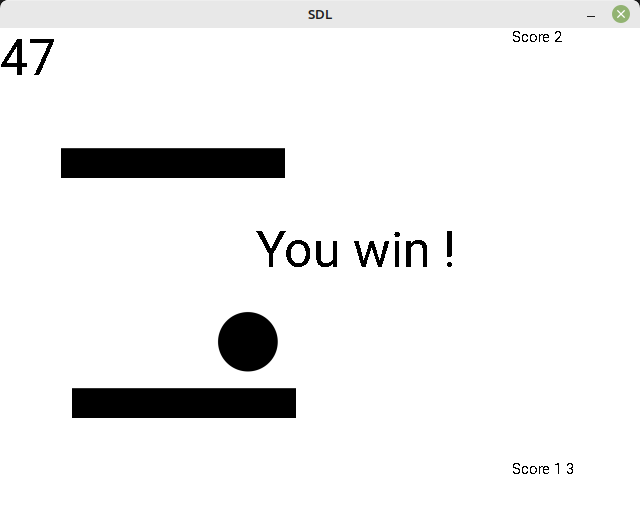

I wanted to make the Pong game using SDL2 and C++. Probably overdid it using a whole bunch of classes, but it's working and not far from a game. 

  

# Requirements

SDL2, SDL2-ttf, SDL2-image

## Installing requirements

__sudo apt install libsdl2-dev libsdl2-image-dev libsdl2-ttf-dev__

Then __cmake -B build -D CMAKE_BUID_TYPE=Release__
And __cmake --build build__

Link the media files before launching Pong (they must be in the same folder than the executable, I might add them in the binary sometime later)

__ln -s media/ build/src/media__

# TODO
* Use this project to try Emscripten
* Use this project to get into game networking
* Checkout useful Cpp20 features
* Use ImGUI instead of custom buttons or stuff
